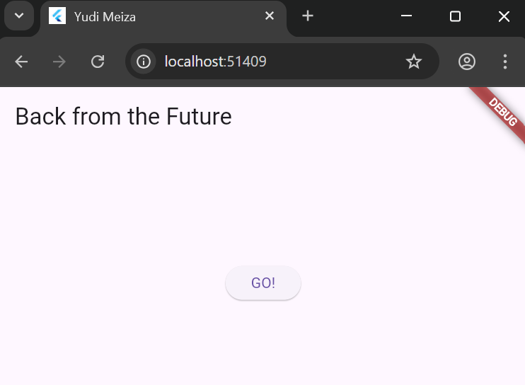
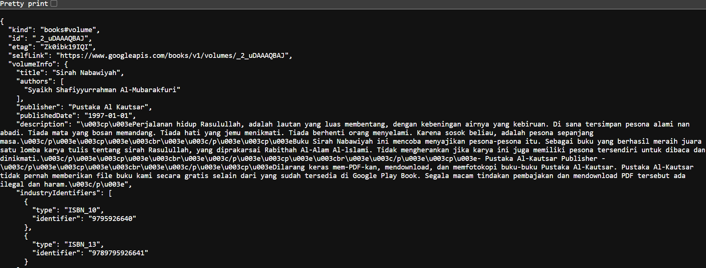
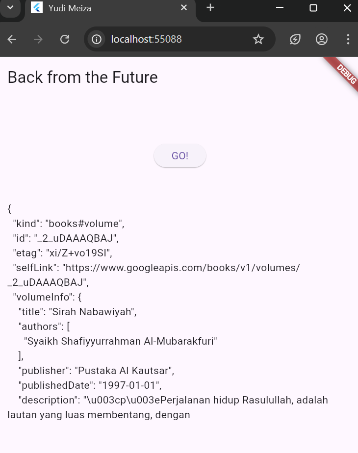

# books_async

## Yudi Meiza

Project Praktikum Pemrograman Asynchronous Semester 6 | Flutter

## Praktikum 1

- Soal 1

  

- Soal 2

  
  Menambahkan fitur async API Google Books.

- Soal 3 

Penjelasan Kode

Langkah 5 pada kode tersebut menambahkan aksi ke tombol **ElevatedButton** yang ketika ditekan akan memanggil fungsi `getData()` untuk mengambil data dari API. Jika berhasil (`then`), hasil respons HTTP akan diambil sebagian menggunakan `substring(0, 450)` agar hanya 450 karakter pertama dari isi respons yang ditampilkan di UI. Jika terjadi error saat permintaan HTTP (misalnya koneksi gagal), maka bagian `catchError` akan menangkapnya dan menampilkan teks `'An error occurred'` sebagai pesan kesalahan. Fungsi `setState()` digunakan untuk memastikan tampilan UI diperbarui setelah data berhasil diambil atau saat terjadi error.

