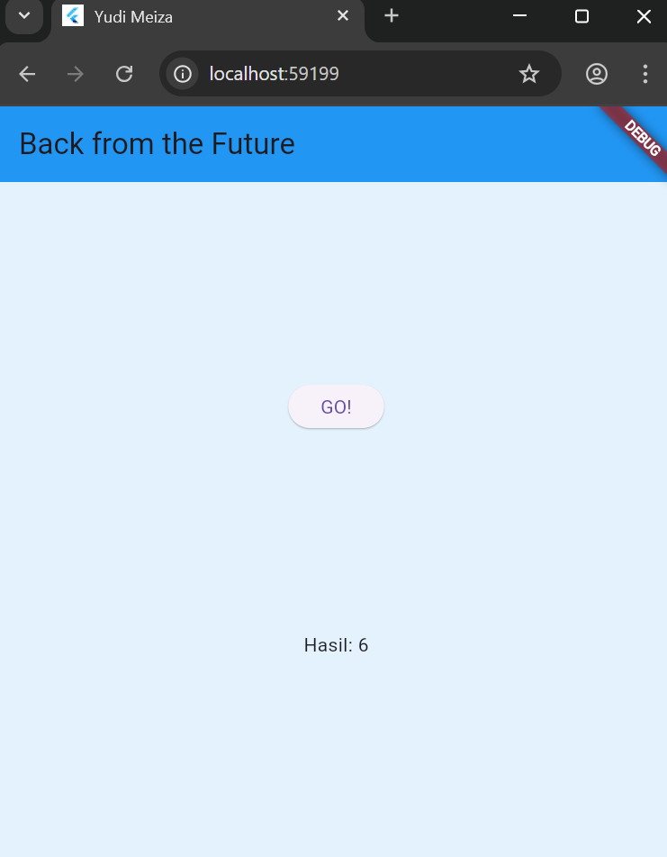

# books_async

## Yudi Meiza

Project Praktikum Pemrograman Asynchronous Semester 6 | Flutter

## Praktikum 1

- Soal 1

  

- Soal 2

  
  Menambahkan fitur async API Google Books.

- Soal 3 

Penjelasan Kode

Langkah 5 pada kode tersebut menambahkan aksi ke tombol **ElevatedButton** yang ketika ditekan akan memanggil fungsi `getData()` untuk mengambil data dari API. Jika berhasil (`then`), hasil respons HTTP akan diambil sebagian menggunakan `substring(0, 450)` agar hanya 450 karakter pertama dari isi respons yang ditampilkan di UI. Jika terjadi error saat permintaan HTTP (misalnya koneksi gagal), maka bagian `catchError` akan menangkapnya dan menampilkan teks `'An error occurred'` sebagai pesan kesalahan. Fungsi `setState()` digunakan untuk memastikan tampilan UI diperbarui setelah data berhasil diambil atau saat terjadi error.

## Praktikum 2

- Soal 4

Penjelasan Kode Langkah 1 & 2 :
**Langkah 1:**
Menambahkan tiga fungsi async (`returnOneAsync`, `returnTwoAsync`, `returnThreeAsync`) yang masing-masing menunggu selama 3 detik sebelum mengembalikan nilai 1, 2, dan 3.
**Langkah 2:**
Membuat fungsi `count()` untuk memanggil ketiga fungsi async tadi secara berurutan dan menjumlahkan hasilnya. Total hasil (1 + 2 + 3 = 6) ditampilkan ke UI melalui `setState()`.
**Langkah 3:**
Menghubungkan tombol **GO!** dengan fungsi `count()` melalui `onPressed`, agar saat tombol ditekan, proses async dan penjumlahan dijalankan.

**Tujuan:**Melatih penggunaan fungsi asynchronous (`async-await`) secara berurutan dalam Flutter dan menampilkannya ke UI.

## Praktikum 3 

- Soal 5

Penjelasan Kode

Kode langkah 2 menggunakan `Completer` untuk menjalankan proses asynchronous secara manual. Fungsi `getNumber()` memanggil `calculate()`, yang menunggu 5 detik lalu menyelesaikan (`complete`) nilai `42`. Nilai ini akan diterima oleh pemanggil `getNumber()` setelah proses selesai.

- Soal 6

Penjelasan Kode

Langkah 2: calculate() hanya menjalankan Future.delayed lalu complete(42) tanpa penanganan kesalahan. Jika terjadi error, program bisa crash.
Langkah 5-6: calculate() dibungkus try-catch. Bila terjadi error, maka completer.completeError() dipanggil. Lalu di Langkah 6, bagian onPressed() menggunakan .catchError() untuk menangani error dan menampilkan pesan 'An error occurred'.

## Praktikum 4

- Soal 7

- Soal 8

